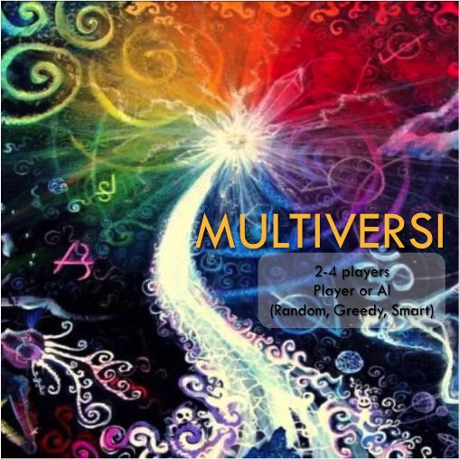
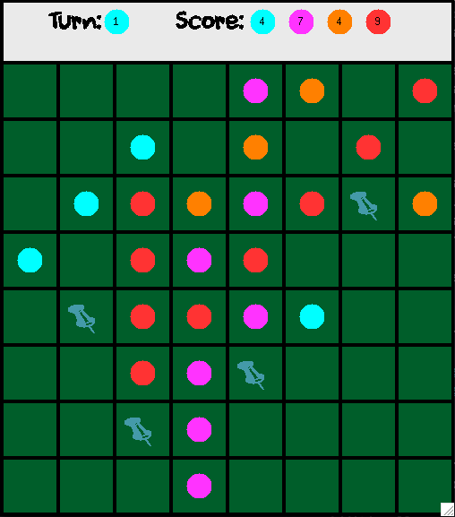

# Multiversi
## Overview

Multiversi is a variant of the classic game Reversi (also known as Othello) written in OCaml as part of Cornell's CS 3110 Functional Programming course.

The rules are similar to Reversi. On your turn, place one piece on the board – it will have a color unique to you. Pins will mark your possible moves.

All the opponent’s pieces between your newly-set piece and your already-existing pieces on the board will be flipped.

Your piece placement if valid only if:
* It results in an opponent’s piece getting flipped
* If the above is not possible, you can place your piece adjacent to any piece on the board

This is where the rules differ from traditional Reversi. In Reversi, the player passes if they have no available moves. We have changed this rule. This is in order to allow the gameplay to work for multiple players, as, in a 4-player game, one of the players is inevitably eliminated before he/she has the chance to even make his/her first move.

The game ends when the board is full. The player with the most pieces wins.

Players can choose to play against their friends or against the AIs we have written. There are 3 AI types:
* Random: randomly chooses one of the available moves
* Greedy: chooses the move that allows it to gain the most number of pieces
* Smart: uses a minimax algorithm to decide the best move

The smart AI is a challenging opponent but not unbeatable. If you're a novice, you will not be able to beat it however. Good luck!

Here are some screenshots of the game:




## Installation

You will need to have OCaml and opam installed. If you do not, please follow the [instructions here](http://www.cs.cornell.edu/courses/cs3110/2018sp/install.html).

If you are using a Mac, you will likely need to install X11/XQuartz for Graphics support. If you installed ocaml with homebrew, it can be done by running
```
brew install Caskroom/cask/xquartz
brew reinstall ocaml --with-x11
```

Then, map opam to use the system installation instead of the currently bound one: opam switch sys. Then run eval `opam config env` as instructed.

You might also need to install the Graphics module. It can be done by running
```
opam install graphics
```

After successfully installing the external libraries, you will be able to run
```
make play
```
to launch the game.

Please contact us if you find any bugs while playing by sending an email to: art85@cornell.edu, cc982@cornell.edu, sa835@cornell.edu.

## Acknowledgments

* We used a short Python script from [Dave Webb's answer](https://stackoverflow.com/questions/138250/how-can-i-read-the-rgb-value-of-a-given-pixel-in-python) on StackOverflow to read in RGB data from an image and save it as a textfile.
* We needed an O(n) array shuffling algorithm for a minor part of the program, namely: shuffling the pixels before drawing them in the introduction screen to get the 'scrambled' effect. We used the Knuth shuffle as written by [octachron in this OCaml discussion thread](https://discuss.ocaml.org/t/more-natural-preferred-way-to-shuffle-an-array/217). We thought of writing it ourselves, but did not see the need to as its implementation was very short and simple.
* Thank you to the CS 3110 course staff for a wonderful course! (: OCaml is bae.
